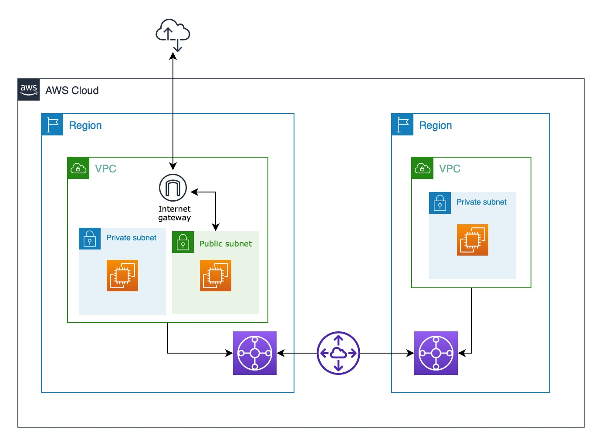

# Transit gateway peering with Terraform (Inter region)

> 1. Create two Transit Gateway(TGW) in us-east-1 & us-west-1
> 2. Peer both TGWs
> 3. Create VPCs in both regions.
> 4. Use only private subnets
> 5. Provision some resources(ec2) under those VPCs
> 6. Test cross region private connectivity between resources.
> 7. If all work then try to create above infra via IAC(terraform/cloud formation any).

## Rough sketch

</img>

## AWS Infrastructure Diagram

</img>

## Steps

----

- Create a VPC 1 in Ohio and VPC 2 in N.California
- Create a private and pub subnet in VPC 1 and private subnet in vpc 2
- Create transit gateways in both regions and attach corresponding VPC's
- Attach transit gateway peering connection and accept
- Add a static route with opposite VPC (vpc in other region) cidr and peering type
- Add opposite routes to corresponding subnet route tables
